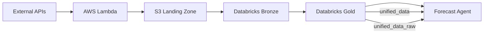

# Research Agent

The Research Agent is the data foundation of the Ground Truth system, responsible for collecting, processing, and preparing all data for forecasting and trading operations.

## Overview

The Research Agent implements a Bronze → Gold medallion architecture on Databricks, transforming raw data from multiple sources into production-ready ML tables.

**Current Production Tables:**
- `commodity.gold.unified_data` - Production (forward-filled, 7,612 rows)
- `commodity.gold.unified_data_raw` - Experimental (NULLs preserved for custom imputation)

## Key Achievement: 90% Data Reduction

**Challenge**: Legacy silver table (`commodity.silver.unified_data`) had 75,000 rows with exploded regional data.

**Solution**: Gold layer with array-based regional data and optimized grain.

**Results**:
- Reduced from 75,000 silver rows to 7,612 gold rows (90% reduction)
- Maintained continuous daily coverage from 2015-07-07 to present
- Weather and GDELT data stored as arrays (65 regions)
- Grain: (date, commodity) instead of (date, commodity, region)

## Architecture

### 6 AWS Lambda Functions

The Research Agent uses event-driven architecture with AWS Lambda (EventBridge triggers at 2AM UTC daily):

1. **market-data-fetcher** - Coffee/Sugar futures prices (ICE, CME)
2. **weather-data-fetcher** - Regional weather (65 producer locations via OpenWeatherMap)
3. **vix-data-fetcher** - CBOE VIX volatility index
4. **fx-calculator-fetcher** - Exchange rates (24 currencies including COP)
5. **cftc-data-fetcher** - Commitment of Traders reports
6. **GDELT pipeline** - News sentiment (4 functions)

**Infrastructure**: Lambda functions → S3 → Databricks Bronze tables

### Data Flow

### Bronze Layer (Raw Data)
- `commodity.bronze.market_data` - Coffee/Sugar OHLCV (trading days only)
- `commodity.bronze.weather` - Regional temperature, humidity, precipitation
- `commodity.bronze.vix` - Market volatility (trading days only)
- `commodity.bronze.fx_rates` - 24 currency pairs
- `commodity.bronze.gdelt` - News sentiment scores (post-2021)

### Gold Layer (Production - Current)
- **`commodity.gold.unified_data`** - Production table (forward-filled, 7,612 rows)
  - All features forward-filled except pre-2021 GDELT
  - Weather/GDELT as arrays
  - Grain: (date, commodity)

- **`commodity.gold.unified_data_raw`** - Experimental table (NULLs preserved)
  - Only `close` price forward-filled
  - Requires custom imputation
  - Includes missingness flags: `has_market_data`, `has_weather_data`, `has_gdelt_data`

## Data Sources

| Source Type | Provider | Update Frequency | Coverage |
|:-----------|:---------|:----------------|:---------|
| **Market Prices** | ICE, CME | Daily | 2015-present |
| **Weather Data** | OpenWeatherMap | Daily | Global regions |
| **Economic Indicators** | FRED, World Bank | Monthly/Quarterly | Macroeconomic factors |
| **FX Rates** | Exchange Rate API | Daily | USD conversion |
| **Volatility** | CBOE (VIX) | Daily | Market sentiment |
| **News Sentiment** | NewsAPI | Daily | Commodity keywords |

## Data Quality Metrics

| Metric | Silver (Legacy) | Gold (Production) | Improvement |
|:-------|:----------------|:------------------|:------------|
| **Rows** | 75,000 (exploded regions) | 7,612 (array-based) | 90% reduction |
| **Grain** | (date, commodity, region) | (date, commodity) | Simplified |
| **Nulls** | 0 (forward-filled) | 0 production, ~30% raw | Flexible |
| **Coverage** | 2015-2024 | 2015-2024 | Same |

## Key Features

### Forward-Fill Interpolation
`commodity.gold.unified_data`: All features forward-filled for continuous daily coverage (weekends, holidays included).

### Array-Based Regional Data
Weather and GDELT stored as arrays instead of exploded rows:
- Weather: 65 regional readings as array
- GDELT: Variable article counts per day
- Result: 90% row reduction (75k → 7.6k)

### Flexible NULL Handling
Two tables for different use cases:
- **Production** (`unified_data`): Forward-filled, ready to use
- **Experimental** (`unified_data_raw`): NULLs preserved for custom imputation strategies

### Delta Lake Storage
- Unity Catalog integration
- ACID transactions
- Time-travel versioning
- Cross-agent data sharing via commodity.* schema

## Documentation

For detailed implementation:
- **Data Architecture**: [UNIFIED_DATA_ARCHITECTURE.md](https://github.com/gibbonstony/ucberkeley-capstone/blob/main/research_agent/docs/UNIFIED_DATA_ARCHITECTURE.md)
- **Data Sources**: [DATA_SOURCES.md](https://github.com/gibbonstony/ucberkeley-capstone/blob/main/research_agent/docs/DATA_SOURCES.md)
- **Build Instructions**: [BUILD_INSTRUCTIONS.md](https://github.com/gibbonstony/ucberkeley-capstone/blob/main/research_agent/docs/BUILD_INSTRUCTIONS.md)

## Code Repository

📂 **[View Research Agent Code on GitHub](https://github.com/gibbonstony/ucberkeley-capstone/tree/main/research_agent)**

Explore the complete implementation including:
- AWS Lambda function definitions
- Data transformation scripts
- ETL pipeline code
- Testing and validation scripts
